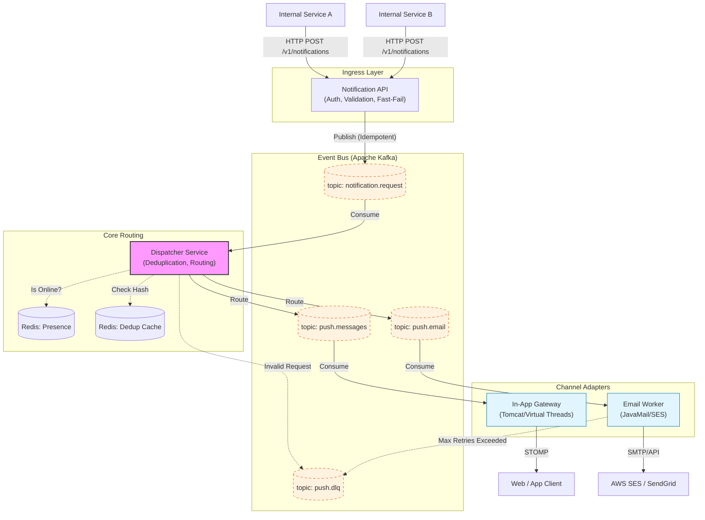

# Notification Platform — System Design

## 1. Overview

Highly available, horizontally scalable real-time Push System.
- **Target**: 1M+ concurrent WebSocket connections
- **Throughput**: 100K messages/sec
- **Latency**: p99 < 100ms end-to-end
- **Availability**: 99.99% (< 52min downtime/year)

---

## 0. Design TODOs

> Known design gaps deferred to avoid over-engineering before v1.0.
> Each item **must be resolved before implementation of its tagged phase**.

- [x] **[Pre-v1.0] Full Platform Architecture** — ~~This doc covers In-App Push Gateway only. The full `Notification API → Dispatcher → Channel Workers` flow and inter-service communication diagram needs to be documented before coding begins.~~ (Resolved via architecture addition)
- [x] **[Pre-v1.0] Tech Stack PoC** — ~~Validate Spring WebFlux + STOMP compatibility on Netty. If integration is complex, evaluate Servlet stack + Virtual Threads as a simpler alternative.~~ (Resolved: Abandoned WebFlux in favor of Servlet + Virtual Threads on Java 21)
- [ ] **[Pre-v2.0] FR-03 Race Condition (TOCTOU)** — Design the scenario: user disconnects *between* presence-check and WS delivery. Specify the ACK timeout window and how it triggers the fallback chain (e.g., WS send failure → emit event to Kafka → FCM consumer picks up).
- [ ] **[Pre-v2.0] NFR-10 Graceful Degradation** — Define per-component Redis failure behavior: Session Registry down / Pub-Sub Relay down / Offline Queue down. What does each fallback to? (e.g., conservative-offline → FCM, DB-backed dedup as last resort)

---

## 2. High-Level Architecture

### 2.1 Full Platform Architecture (Logical)

This diagram illustrates the end-to-end data flow from the moment an internal service requests a notification to its final delivery via multiple channel adapters. The Dispatcher isolates the routing and templating complexity away from the individual channel workers.



### 2.2 In-App Push Gateway Architecture (Physical)

This specifically details the physical connection flow inside `In-App Gateway(WebSocket)`.

```
┌─────────────────────────────────────────────────────────────────────┐
│                          CLIENT LAYER                               │
│  Mobile App / Web Browser / IoT Device                              │
└──────────────────────────┬──────────────────────────────────────────┘
                           │ WebSocket (STOMP) / SSE fallback
                           ▼
┌─────────────────────────────────────────────────────────────────────┐
│                      API GATEWAY / L7 LB                            │
│  Sticky Session (ip_hash) · TLS Termination · Rate Limiting         │
└──────┬────────────────────────────────┬───────────────────────────┘
       │                                │
       ▼                                ▼
┌────────────────┐              ┌────────────────┐
│  Push Gateway  │      ...     │  Push Gateway  │  ← N instances
│  (WS Server)   │              │  (WS Server)   │
└───────┬────────┘              └───────┬────────┘
        │                               │
        │     ┌─────────────────────┐   │
        └────►│   Redis Cluster     │◄──┘
              │  · Connection Map   │
              │  · Pub/Sub Relay    │
              │  · Presence         │
              │  · Rate Limit       │
              └──────────┬──────────┘
                         │
        ┌────────────────┼────────────────┐
        ▼                ▼                ▼
┌─────────────┐  ┌─────────────┐  ┌─────────────┐
│   Kafka     │  │  Kafka      │  │   Kafka     │
│ Topic:push  │  │ Topic:dlq   │  │  Topic:ack  │
└──────┬──────┘  └─────────────┘  └─────────────┘
       │
       ▼
┌─────────────────────────────────────────────────┐
│              Message Consumer Service            │
│  · Fan-out · Retry · DLQ · Dedup                │
└──────────────────────┬──────────────────────────┘
                       │
        ┌──────────────┼────────────────┐
        ▼              ▼                ▼
┌─────────────┐ ┌─────────────┐ ┌─────────────┐
│  PostgreSQL │ │   Redis     │ │  Prometheus │
│  · Devices  │ │  · Offline  │ │  · Metrics  │
│  · DelivLog │ │    Queue    │ │             │
│  · Subscr.  │ └─────────────┘ └─────────────┘
└─────────────┘
```

---

## 3. Component Breakdown

### 3.1 Push Gateway (WebSocket Server)
**Role**: Client connection management, message reception and delivery

- **Protocol**: STOMP over WebSocket (graceful degradation → SSE)
- **Connection Model**: Apache Tomcat via Spring MVC (Servlet) + Spring WebSocket (STOMP) + **Java 21 Virtual Threads**
- **Capacity**: ~50K connections per instance (requires OS fd limit tuning)
- **Health Check**: `/actuator/health/liveness`, `/actuator/health/readiness`

**Connection Flow**:
```
Client → WS Upgrade → JWT Auth Filter → Session Registration (Redis)
                                       → Flush offline messages
```

**Disconnect Flow**:
```
TCP FIN / Heartbeat timeout → Remove Session (Redis)
                            → Update Presence
                            → Move undelivered messages to offline queue
```

### 3.2 Redis Connection Registry
**Structure**:
```
push:session:{userId}   → Set<sessionId>          (TTL: 3600s)
push:session:{sessionId} → {serverId, userId, ...} (TTL: 3600s)
push:presence:{userId}  → "online" | timestamp    (TTL: 60s, heartbeat refresh)
push:offline:{userId}   → List<message>           (LPUSH/BRPOP, max 1000)
push:ratelimit:{userId} → Token Bucket            (TTL: 1s)
```

**Pub/Sub Relay**:
```
Channel: push:relay:{serverId}
- Gateway A → Redis PUBLISH push:relay:server-B → Gateway B → Client
```

### 3.3 Kafka Topics

> **Partition Sizing**: `partitions = target_TPS / throughput_per_partition`
> 100K msg/s ÷ ~5K msg/s per consumer = 20 → rounded up to **32** (power-of-2).
> Start conservative; scale up incrementally after load profiling.

| Topic | Partitions | Retention | Purpose |
|-------|-----------|-----------|---------|
| `push.messages` | 32 | 24h | Outbound messages targeting clients |
| `push.acks` | 16 | 6h | Client acknowledgments (ACK) |
| `push.dlq` | 8 | 7d | Failed messages |
| `push.events` | 16 | 24h | Connect/Disconnect events |

**Partition Key**: `userId` hash → Guarantees message ordering per user

### 3.4 Message Flow

#### Online User (Fast Path):
```
Producer → Kafka(push.messages)
         → Consumer → Redis lookup(user session)
         → Redis PUBLISH(push:relay:{serverId})
         → Gateway → WebSocket → Client
         → Client ACK → Kafka(push.acks)
```

#### Offline User (Slow Path):
```
Producer → Kafka(push.messages)
         → Consumer → Redis lookup(no session found)
         → Redis LPUSH(push:offline:{userId})
         → [User comes online]
         → Gateway → Redis BRPOP → flush to client
```

---

## 4. Key Design Decisions

### 4.1 Fan-out Strategy
- **1:1 direct**: Direct routing via `userId`
- **1:N broadcast**: Topic/Channel subscribe approach
  - Channel subscription info persisted in PostgreSQL, cached in Redis
  - Consumer retrieves channel subscriber list → distributed delivery per `userId`
  - **Fan-out threshold**: > 10K subscribers → Handle via dedicated Kafka fan-out topic

### 4.2 Message Ordering
- Partition key = `userId` → Messages for the same user land in a single partition
- Snowflake ID 기반 messageId (timestamp + serverId + seq)
- Client-side reordering: 200ms buffer window

### 4.3 Exactly-Once Delivery
- **Producer**: `acks=all`, `enable.idempotence=true`
- **Consumer**: manual commit after Redis ACK
- **Deduplication**: Redis SET `push:dedup:{messageId}` (TTL: 10min)
- **At-least-once → Client ack**: If no client ACK received, retry up to 3 times, then route to DLQ

### 4.4 Backpressure & Rate Limiting
- **Token Bucket** per userId: 100 msg/sec burst, 10 msg/sec sustained
- **Kafka Consumer**: `max.poll.records=500`, adaptive fetch
- **Circuit Breaker** (Resilience4j): Fallback triggers on DB/Redis failures

### 4.5 Graceful Shutdown
```
SIGTERM → 
  1. Stop accepting new WS connections
  2. Drain in-flight Kafka messages (30s timeout)
  3. Notify connected clients (server-sent close frame)
  4. Deregister from Redis
  5. JVM shutdown
```

---

## 5. Scalability

### Horizontal Scaling
- **Gateway**: Stateless (session state in Redis) → HPA on CPU/connection count
- **Consumer**: Kafka consumer group → Parallel consumption aligning with partition count
- **Redis**: Cluster mode (16384 slots)
- **PostgreSQL**: Read replica-s + PgBouncer connection pooling

### Capacity Estimation
```
1M connections ÷ 50K/instance = 20 Gateway instances
100K msg/sec × avg 1KB = 100MB/s Kafka throughput
Redis: 1M sessions × 200B = 200MB memory
```

---

## 6. Resilience Patterns

| Pattern | Tool | Scenario |
|---------|------|----------|
| Circuit Breaker | Resilience4j | DB/Redis connection failures |
| Retry | Resilience4j | Kafka publish failures |
| Bulkhead | Virtual Thread pool isolation | Consumer overload isolation |
| Rate Limit | Redis Token Bucket | Client DoS protection |
| Timeout | WebClient + CompletableFuture | Downstream service latency |
| DLQ | Kafka DLQ Topic | Permanent message failures |

---

## 7. Observability

### Metrics (Micrometer → Prometheus → Grafana)
- `push.connections.active` (gauge)
- `push.messages.published` (counter)
- `push.messages.delivered` (counter)
- `push.messages.failed` (counter)
- `push.delivery.latency` (histogram, p50/p95/p99)
- `push.offline.queue.size` (gauge per userId)
- `kafka.consumer.lag` (gauge per partition)

### Tracing
- OpenTelemetry → Jaeger
- TraceId: messageId 기반 propagation

### Alerts
- Consumer lag > 10K → PagerDuty
- p99 latency > 500ms → Alert
- Error rate > 1% → Alert

---

## 8. Security

- **Authentication**: JWT (RS256) on WS handshake
- **Authorization**: Channel-level ACL (Redis cached)
- **TLS**: mTLS between internal services
- **Message Encryption**: Optional AES-256-GCM per channel
- **DDoS**: L7 rate limiting at Gateway, L3/L4 at load balancer

---

## 9. Deployment (Kubernetes)

```yaml
Gateway:      20 pods × 4CPU/8GB  (HPA: 10-50 pods)
Consumer:     10 pods × 2CPU/4GB  (HPA: 5-30 pods)
Redis:        6 nodes cluster (3 primary + 3 replica)
Kafka:        6 brokers (32 partitions per topic, RF=3)
PostgreSQL:   1 primary + 2 read replicas + PgBouncer
```

---

## 10. Tech Stack Summary

| Layer | Technology |
|-------|-----------|
| Language | Java 21 (Virtual Threads) |
| Framework | Spring Boot 3.3 + Spring MVC |
| WebSocket | Spring WebSocket (STOMP) + Tomcat |
| Messaging | Apache Kafka 3.6 |
| Cache/Registry | Redis 7.x Cluster |
| Database | PostgreSQL 16 + PgBouncer |
| Resilience | Resilience4j 2.x |
| Observability | Micrometer + OpenTelemetry + Prometheus |
| Build | Gradle 8 (multi-module) |
| Container | Docker + Kubernetes |
